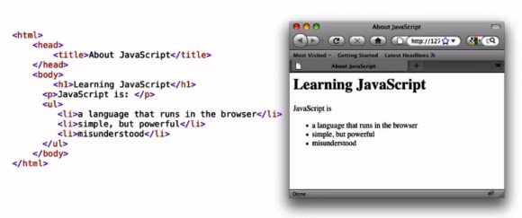
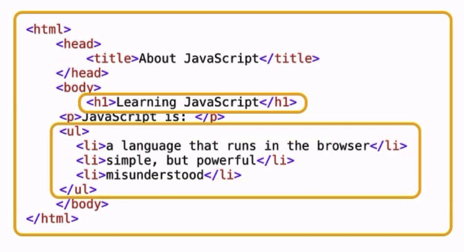
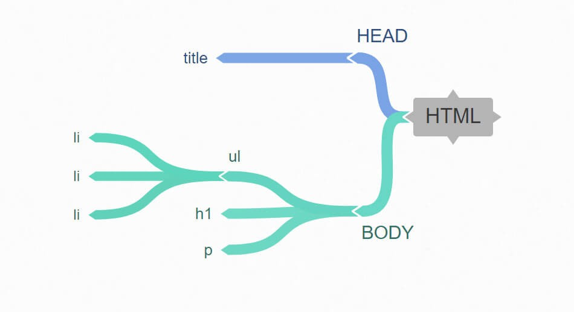

I’m going to write about one of the core concepts of the web; DOM. So whether you’re brand-new to JavaScript or maybe you’ve been working before, this paper is not bad to see. We’ll understand the DOM, the Document Object Model. Those who have spent several years living in JavaScript have their way around the DOM to be the single most important skill for a web programmer to develop. But this is a term that’s often a little tough to understand the first time you hear it because it’s kind of vague. People ask well, what is the DOM? Is it a language, is it part of JavaScript? What is it? When you google the term DOM, you find phrases like, “The Document Object Model is an application programming interface that defines logical structure of well-formed an XML and HTML documents,” and it really doesn’t help most people, but it’s quite a simple idea in mind.

So let’s take the DOM piece by piece. Well, what do I mean by document? Well, for us, the document simply means the page, not the site, the web page; the web page is the document which can be represented in different ways. You know this already.

After all, which one of these is the web page? Well, both of them. One is the browser view, one is the source code. It’s the same document; it can have a different representation. What we need to also understand is how JavaScript observes the same document and different representation.

By now we understand what is document part of DOM. But what’s the object part of the Document Object Model? Well, when we talk about objects in programming languages, it’s really easy to get wound up in deep semantic meaning, but we don’t need to.
Dates are objects, arrays are objects. I can make my own objects. An object is just a thing, something, anything that makes sense to treat as an individual piece, even if it contains other things. For us, it really means the elements, the components, the individual pieces of this document. Look at the h1 tag, look at the unordered list part, look at the whole document. All of these things are objects.

Now, It’s the turn of Model. You’ve seen flowcharts or database diagrams to taking something complex and making it abstract. In a web page, we are able to take any HTML and represent it as a tree structure like this:

With the simplest of HTML here, it contains a head and a body. The head itself contains the title element, the body contains an h1 for a heading, a p for a paragraph, and an unordered list. The unordered list contains three list items. We’re able with this diagram to represent the tree structure of this HTML document.

We call each of these pieces nodes. Paragraph tag or a body or h1 all are nodes. We could even describe relationships, like ancestors and descendants. So the model is simply a set of terms that we can agree on, a set of standards that we can use. So what we end up with is an agreed-upon set of terms that describe exactly how to interact with the pieces of a web page. That’s a long phrase, so we call it the Document Object Model. It’s not a language. It’s a convention. It’s an agreed-upon terminology that will let us describe and interact with any web page. Not one specific one, anyone. When I know the basic concepts of the DOM, I can write JavaScript that navigates around any page. That’s why we need to know the DOM. It is the way to reach into the page from our script and the way our page can reach into our script.
