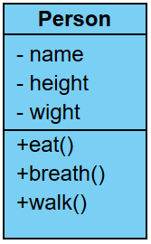
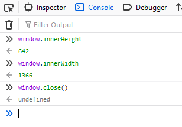
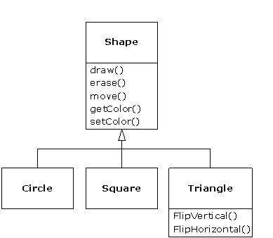

### What is object-oriented programming?

Object-oriented programming is a programming paradigm or style of programming that is centered around objects rather than functions. We know that It's not a new concept, it's been around since the 70's, but unlike tools and frameworks that come and go, object-oriented programming is still very relevant today, that's because it's not a programming language or tool.

It's a style of programming or a programming paradigm. There are several programming languages out there that support object oriented programming, such as C#, Java, Ruby, Python, JavaScript, and more. Now JavaScript is a little bit controversial, as it is based on prototypes. It may be interesting to you to know that many of the popular frameworks out there are actually designed with object oriented programming concepts in mind. Angular is a sample of these frameworks.

Object-oriented programming is a very popular style of programming, and it also comes up in many technical interviews. Lets dive into four major principles of this style.

### Four principles of OOP

There are four major principles in object-oriented programming. These principles are **encapsulation**, **abstraction**, **inheritance**, and **polymorphism**. Let's look at each of these principles. Before object-oriented programming, many developers were developing in procedural programming, which is dividing a program into a set of functions. As a result, you have data stored in a bunch of variables and functions that operate on the data. This style of programming is very simple and straightforward and suitable for learning a new programming language. 

When your programs start to grow, you will find that these bunch of functions are all over the place. You might find yourself struggling lines of code over and over to make a small change in your application. Beside that most of the time, tracking errors and maintaining would be such a pain in the neck. That's what we call spaghetti code, where, there is so much dependency in all these functions which might spell problems for developers. 

To address this problem, object-oriented programming has been introduced. In object-oriented programming we would combine a group of related variables and functions into a unit. We call that unit an object. We refer to these variables as properties, and the functions as methods. To illustrate, think of a person. A person is an object with properties such as height, weight, and name, and methods like walk, eat, and breath. 

Now you might think that this example is not real: we don't have person in our programs! Okay, let me give you a real example. Lets talk about window object. The window object represents an open window in a browser. This object has a wide range of properties such as `innerHeight` and `innerWidth` which return the height and width of a window's content area (viewport) including scrollbars. That has also a lot of method such as close() which closes the current window.

So in object-oriented programming you group related variables, and functions that operate on them into objects. And this an important concept what we call **encapsulation**. 

One of the symptoms of procedural code is functions with so many parameters. When you write code in an object oriented way, your functions will have fewer and fewer parameters. As **Uncle Bob** says: 

> the best functions are those with no parameters.

The fewer the number of parameters lead to the easier maintaining. So that's encapsulation. Now let's look at **abstraction**. 

Think of a TV set as an object. This TV has a complex logic interact with. You simply press the turn on button and you don't care what happens on the inside. All that complexity is hidden from you. This is abstraction in practice. We can use the same technique in our objects. So we can hide some of the properties and methods from the outside, and this gives us a couple benefits:

1. The interface of those objects would be far more simpler. Using and understanding an object with a few properties and methods is easier than an object with several properties and methods. 
2. It helps us reduce the impact of change. Let's imagine that we will change the inner or private methods of an object. None of changes will leak to the outside, because we don't have any code that touches these methods outside of their containing object. You may delete the method, or change it's parameters, but none of these changes will impact the rest of the applications code. So, with abstraction, you reduce the impact of changes.

**Inheritance** is third principle of OOP which is a mechanism that allows you to eliminate redundant code. Here is an example. Think that we have shape object. Triangle, circle and square all are a shape. if we have some common methods like `draw()`, we can move it to parent in order to share between all child instead of repeat draw method for all of them:

And finally **Polymorphism**, Poly means many, morph means form. So poly morphism means many forms. In object-oriented programming, polymorphism is a technique that allows you to get rid of long  condition statements. Imagine we have an animal object. It has 2 children : cat and dog. All animals make sound. So we have a `makeSound()` method in animal object. But both cat and dog make sound differently. So we have to change this method in the child instances. With object-orientation we can implement a `makeSound()` method in each of these objects, and the `makeSound()` method will behave differently depending on the type of the object we are referencing. So, we could get rid of this nasty switch and case.

### Recap

To recap the principles of OOP I should say that by **encapsulation**, we group related variables and functions together then reuse this object in different parts of the program, or in different programs. With **abstraction**, we hide the details and the complexity and show only the essentials. This technique reduces complexity, and also isolates the impact of changes in the code. With **inheritance** we can eliminate redundant code, and with **polymorphism**, we can refactor ugly switch case statements.
