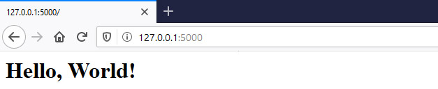
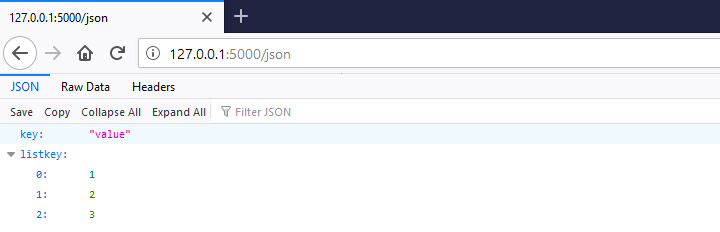
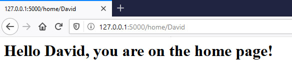
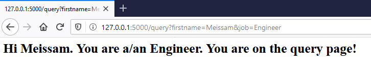
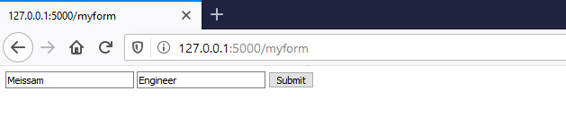
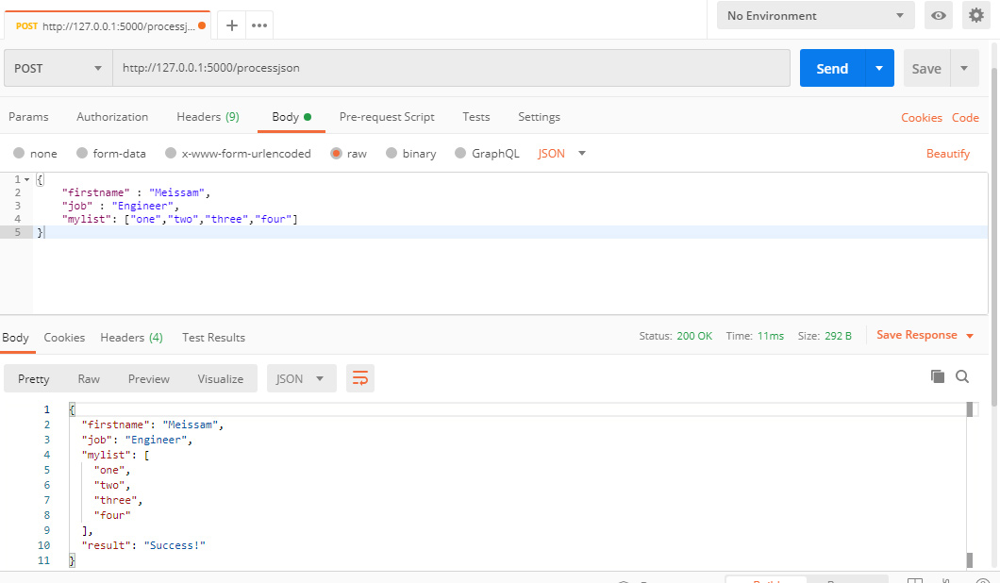

There are a wide array of [Python web frameworks](https://wiki.python.org/moin/WebFrameworks) all around and [Flask](https://flask.palletsprojects.com/en/1.1.x/) is one of them but we should consider that it is not a fullstack web framework. It is “*a microframework for Python based on [Werkzeug](https://werkzeug.palletsprojects.com/en/1.0.x/), [Jinja 2](https://jinja.palletsprojects.com/en/2.11.x/).*” Includes a built-in development server, unit testing support, and is fully Unicode-enabled with [RESTful](https://en.wikipedia.org/wiki/Representational_state_transfer) request dispatching and [WSGI compliance](https://en.wikipedia.org/wiki/Web_Server_Gateway_Interface).

In this article I'm going to have an overview of Flask routes module and I suppose that you've previously installed Python and Flask on your computer. If not, please follow [this instruction](https://flask.palletsprojects.com/en/1.1.x/installation/). 

### Intro to Routes

First, we should import Flask. `app` will be equal to flask and you pass in the name of the module and then you use the decorator app to specify which route you want to write code for. So in this case I want to write code for the index. I just specify the slash and then underneath the decorator I add a function. We usually name the function after the route and that function are responsible for doing desired tasks if the route is met.

```python
from flask import Flask
app = Flask(__name__)

@app.route('/')
def index():
    return '<h1>Hello, World!</h1>'

if __name__ == '__main__':
    app.run(debug=True)
```

the result would be like this: 



By this method, we can create custom routes. For example a route for home will be like this: 

```python
from flask import Flask
app = Flask(__name__)

@app.route('/')
def index():
    return '<h1>Hello, World!</h1>'

@app.route('/home')
def home():
    return '<h1>You are on the home page!</h1>'

if __name__ == '__main__':
    app.run(debug=True)
```

In both above examples we returned string in our function. We are also able to return `Json`. for this we should import `jsonify` and pass a dictionary as an argument to it. Like this: 

```python
from flask import Flask, jsonify
app = Flask(__name__)

@app.route('/')
def index():
    return '<h1>Hello, World!</h1>'

@app.route('/home')
def home():
    return '<h1>You are on the home page!</h1>'

@app.route('/json')
def json():
    return jsonify({'key' : 'value', 'listkey' : [1,2,3]})

if __name__ == '__main__':
    app.run(debug=True)
```

and the the output would be like this: 




### Route Methods

By default the endpoints that are created by the app route decorator are for GET requests only. In order to support POST request we should define it in route arguments: 

```python
@app.route('/home', methods=['POST', 'GET'])
def home():
    return '<h1>You are on the home page!</h1>'
```


### Route Variables

A typical feature of a web app is to allow users to pass in custom information and to do that, one of the methods is passing variables in the URL itself. For example I'm going to add a name variable to home route and print it by format method. It is important to consider that both the name of variable which comes beside home route and the argument of the function should be equal: 

```python
@app.route('/home/<firstname>', methods=['POST', 'GET'])
def home(firstname):
    return '<h1>Hello {}, you are on the home page!</h1>'.format(firstname)
```

we should also define another route with default value for our variable in cases that user don't enter any value and requests home URL solely. We can also define the type of our variable as I set string for `firstname`. it means the first name should be string otherwise it will go through an error: 

```python
@app.route('/home', methods=['POST', 'GET'], defaults={'firstname' : 'Meissam'})
@app.route('/home/<string:firstname>', methods=['POST', 'GET'])
def home(name):
    return '<h1>Hello {}, you are on the home page!</h1>'.format(name)
```

the output is: 




### Request Query String in Flask Route

In addition to building the URL there are other ways of passing in data into the app. Next we'll look at how to pass in data using a query string. First we should import request component from Flask:

```python
from flask import Flask, jsonify, request
```

 then  I'll create a route to handle getting data from a query string with `request.args`:

```python
@app.route('/query')
def query():
    firstname = request.args.get('firstname')
    job = request.args.get('job')
    return '<h1>Hi {}. You are a/an {}. You are on the query page!</h1>'.format(firstname, job)
```

and the output would be: 




### Request Form Data in Flask Route

I would like to show you how you can have a form and how you can send its data to another route. In order to this I'll create a route called `myform` and then submit its data to `processform` route. Please consider that like processing query string which we've learned above, this part also needs to import the "request" component and using `request.form`: 

```python
@app.route('/myform')
def myform():
    return '''<form method="POST" action="/processform">
                  <input type="text" name="firstname">
                  <input type="text" name="job">
                  <input type="submit" value="Submit">
              </form>'''

@app.route('/processform', methods=['POST'])
def processform():
    firstname = request.form['firstname']
    job = request.form['job']

    return '<h1>Hello {}. You are a/an {}. You have submitted the form successfully!<h1>'.format(firstname, job)
```

the result would be:




In above example we used `processform` to process our data. We can use the same route for both form presentation and processing data. We can do it by changing `myform` function and use a simple condition: 

```python
@app.route('/myform', methods=['GET', 'POST'])
def myform():
    if request.method == 'GET':
        return '''<form method="POST" action="/myform">
                    <input type="text" name="firstname">
                    <input type="text" name="job">
                    <input type="submit" value="Submit">
                </form>'''
    else:
        firstname = request.form['firstname']
        job = request.form['job']
        return '<h1>Hello {}. You are a/an {}. You have submitted the form successfully!<h1>'.format(firstname, job)
```

Please consider that we changed the value of `action` attribute in form to `myform`. Although the mentioned pattern is handy, another pattern is to use to same route with different methods which I don't demonstrate it. 

### Request JSON Data in Flask Route

There's one more way to pass request data to your flask app and that method is using Json object. I'm going to use `jsonify` and `request` components again. First I'll create a new route called `processjson` with POST method. Then we should use `get_json` method of request object : 

```python
@app.route('/processjson', methods=['POST'])
def processjson():
    data = request.get_json()
    
    firstname = data['firstname']
    job = data['job']
    mylist = data['mylist']

    return jsonify({'result' : 'Success!',
                    'firstname' : firstname,
                    'job' : job,
                    'mylist' : mylist})
```

To demonstrate the output I'll use Postman to create a request to my app: 




### Redirects and url_for in Flask Route

Oftentimes in a web application you'll want to redirect a user to another location once they're done something. An example would be after user logs in. You can redirect them to the page that they were at before they logged in. You can redirect them to the home page or you can redirect them to an account dashboard. In order to this we should first import `redirect` and `url_for` components from Flask:

```python
from flask import Flask, jsonify, request, url_for, redirect
```

to show the application of these components I'll make a little change to our form example: 

```python
@app.route('/myform', methods=['GET', 'POST'])
def myform():
    if request.method == 'GET':
        return '''<form method="POST" action="/myform">
                    <input type="text" name="firstname">
                    <input type="text" name="job">
                    <input type="submit" value="Submit">
                </form>'''
    else:
        firstname = request.form['firstname']
        job = request.form['job']
        ## return '<h1>Hello {}. You are a/an {}. You have submitted the form successfully!<h1>'.format(firstname, job)

        return redirect(url_for('home', firstname=firstname, job=job))
```

After submit form it will be redirected to home and pass the `firstname` to it. If you pay attention to home route you will find that the home route just accept `firstname` as a variable but there isn't any variable for job. So it passed as a query string. The output is like: 


### Recap

In this tutorial I tried to overview all the necessary concepts of Flask Route. I hope it would be helpful for you to start your journey in creating more complex applications and APIs. here is final version of all code we wrote above: 

```python
from flask import Flask, jsonify, request, url_for, redirect

app = Flask(__name__)

@app.route('/')
def index():
    return '<h1>Hello, World!</h1>'


@app.route('/home', methods=['POST', 'GET'], defaults={'firstname' : 'Meissam'})
@app.route('/home/<string:firstname>', methods=['POST', 'GET'])
def home(firstname):
    return '<h1>Hello {}, you are on the home page!</h1>'.format(firstname)


@app.route('/json')
def json():
    return jsonify({'key' : 'value', 'listkey' : [1,2,3]})


@app.route('/query')
def query():
    firstname = request.args.get('firstname')
    job = request.args.get('job')
    return '<h1>Hi {}. You are a/an {}. You are on the query page!</h1>'.format(firstname, job)


@app.route('/myform', methods=['GET', 'POST'])
def myform():
    if request.method == 'GET':
        return '''<form method="POST" action="/myform">
                    <input type="text" name="firstname">
                    <input type="text" name="job">
                    <input type="submit" value="Submit">
                </form>'''
    else:
        firstname = request.form['firstname']
        job = request.form['job']
        ## return '<h1>Hello {}. You are a/an {}. You have submitted the form successfully!<h1>'.format(firstname, job)

        return redirect(url_for('home', firstname=firstname, job=job))


""" # we commented process form and used condition in myform route

@app.route('/processform', methods=['POST'])
def processform():
    firstname = request.form['firstname']
    job = request.form['job']

    return '<h1>Hello {}. You are a/an {}. You have submitted the form successfully!<h1>'.format(firstname, job)

"""


@app.route('/processjson', methods=['POST'])
def processjson():
    data = request.get_json()
    firstname = data['firstname']
    job = data['job']
    mylist = data['mylist']

    return jsonify({'result' : 'Success!', 'firstname' : firstname, 'job' : job, 'mylist' : mylist})


if __name__ == '__main__':
    app.run(debug=True)
```

